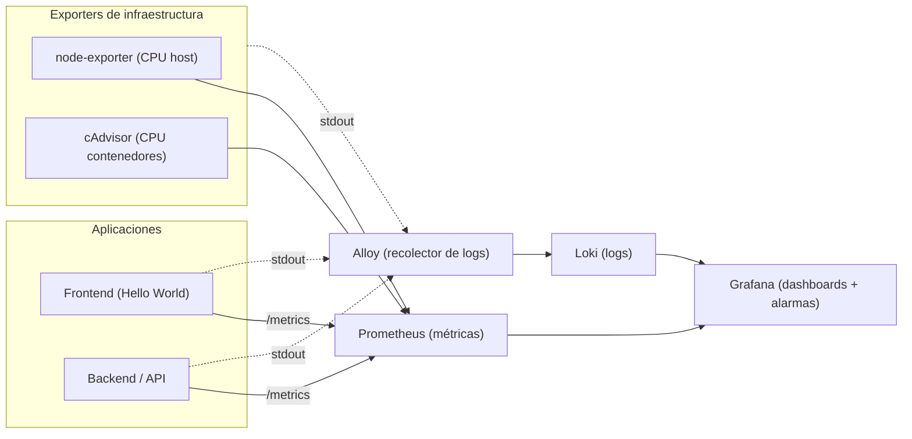

# Laboratorio 10 - Observabilidad

**Curso:** Infraestructura como Código

**Alumno:** Yamile Yasuri Mayli Centa Fernandez

---

## Arquitectura del laboratorio



---

## Prerrequisitos

- **Docker** y **Docker Compose** instalados y funcionando (`docker --version`, `docker compose version`).
- Un navegador web.
- Los archivos del proyecto entregados por el docente (carpeta del laboratorio con su `docker-compose.yml`).
- Puertos libres en tu máquina: `3000`, `3001`, `3100`, `8080`, `8081`, `9090`, `9100`, `12345`.

---

## Ejecución

### Levantar el stack en Docker

   Desde la carpeta del proyecto:

   ```bash
   docker compose up -d --build
   ```

   Una vez los contenedores esten marcados como "Pulled", luego se verifica el estado:

   ```bash
   docker compose ps
   ```

   En los servicios se debe contemplar lo siguiente:

   | Servicio   | URL                       | Qué deberías ver                        |
   |------------|---------------------------|-----------------------------------------|
   | Frontend   | http://localhost:8080     | Página "Hello World" con dos botones    |
   | Backend    | http://localhost:3001/metrics | Texto de métricas en formato Prometheus |
   | Grafana    | http://localhost:3000     | Login (usuario `admin`, clave `admin`)  |
   | Prometheus | http://localhost:9090     | Interfaz de Prometheus                   |

 ---

## Creación de Dashboards en Grafana
### Ingresar a Grafana
Usar las credenciales por defecto:
- User: admin
- Pass: admin

---

### Dashboard

Ingresar: **Dashboards → Observabilidad - Mayli Centa**
Se deben de observar 4 paneles:
- **CPU backend (%)**
    - Fuente de datos → Prometheus
    - Editor → `sum(rate(container_cpu_usage_seconds_total[1m])) by (name) * 100` // Cambie la consulta original dada, en mi caso no mostraba nada.
    - Tipo de visualización: Serie temporal
    - Unit: Percent (0–100)
    - Thresholds: umbral en 50 con color rojo

- **CPU host (%)**
    - Fuente de datos → Prometheus
    - Editor → `100 - (avg(rate(node_cpu_seconds_total{mode="idle"}[1m])) * 100)`
    - Tipo de visualización: Serie temporal
    - Unit: Percent (0–100).

- **Logs de aplicación**
    - Fuente de datos → Loki
    - Editor →  `{tier="application"} | json`
    - Tipo de visualización: Logs
        - Filtro: `{tier="application"} | json | level="ERROR"`
        - Filtro: `{tier="application"} | json | level="INFO"`
- **Logs de infraestructura**
    - Fuente de datos → Loki
    - Editor →  `{tier="infrastructure"}`
    - Tipo de visualización: Log

---
## Estado de alerta
Nos dirigimos al frontend desde el navegador y presionamos el boton ``Generar carga de CPU (30s)``

Vamos a: **Alerting → Alert rules → New alert rule**

- Usamos la misma Query A del panel 1
- IS ABOVE → 50
- Intervalo de evaluación de 10s
- Pending period: 30s
- Labels: severity = warning

La alerta debe pasar de **Normal → Pending → Firing → Normal(Una vez finaliza la carga)**

---

### Ver log de la alerta

Vamos a Alerting -> Contact points -> New contact point.

- Nombre: Webhook Alerts

- Integration: Webhook

- URL: http://host.docker.internal:3001/alerts.

- Probar configuración: Clic en Test para enviar una alerta de prueba y verificar que todo este correcto

Vamos a Alerting -> Notification policies

- Enlazamos la alerta con el Webhook para que este activo 

Disparamos la alarma
- Generamos la carga de CPR (30s)
- El backend registrará un log de la alerta, que volverá a aparecer en el panel "Logs de infraestructura". 
- SE visualiza el recorrido completo: una métrica cruza un umbral → se genera una alarma → la alarma produce un log → el log se observa en el dashboard.

---
## Comandos utilizados
```bash
docker compose up -d --build     # levantar / reconstruir
docker compose ps                # estado de los servicios
docker compose down              # detener (conserva dashboards)
docker compose down -v           # detener y borrar todos los datos
```
---
## Preguntas a responder

**1. ¿Por qué necesitamos Loki además de Prometheus si ya tenemos `/metrics`?**

Porque cumplen funciones distintas y complementarias dentro del stack. Prometheus se encarga de la parte numérica y cuantitativa comoo métricas en el tiempo, contadores, porcentajes. Lo que nos permite saber el cuándo y el qué está pasando, por ejemplo, detectar un pico de CPU o de errores 500. Por otro lado, Prometheus no entiende de texto. Ahí es donde entra Loki para gestionar la parte cualitativa: almacena las líneas de texto completas de los logs, permitiendo leer la traza exacta del error para entender el porqué pasó el evento. Sin Loki, sabríamos que el sistema falló, pero estaríamos adivinando a ciegas la causa raíz del problema en el código.

**2. ¿Qué ventaja aporta que las fuentes de datos de Grafana estén aprovisionadas como código y no creadas a mano?**

Aporta automatización, reproducibilidad y los principios de GitOps al desarrollo. Al definir las conexiones a Prometheus y Loki en archivos de configuración declarativos, garantizamos que el stack completo se levante listo para usarse desde un solo comando, sin depender de la intervención humana ni de clics manuales en la interfaz web. Esto no solo elimina el error humano y acelera los despliegues o la recuperación ante desastres, sino que también permite versionar toda la configuración en Git, facilitando el trabajo en equipo con tus compañeros y permitiendo rastrear o auditar cualquier cambio en la infraestructura de monitoreo.

**3. El panel "CPU contenedor" y el panel "CPU host" pueden mostrar valores muy distintos. ¿Por qué? ¿Cuál usarías para alertar sobre una aplicación concreta?**

Muestran valores distintos por una cuestión de alcance y aislamiento de recursos. El "CPU host" mide el consumo total de la máquina física o virtual completa (que suele tener múltiples núcleos y ejecutar procesos del sistema operativo), mientras que el "CPU contenedor" representa únicamente el consumo del proceso aislado dentro de Docker en base a los recursos asignados. Por eso es que un contenedor puede estar sufriendo al 100% de su capacidad permitida, pero en la gráfica del host general eso representa apenas un 2% o un 3% del total. Para alertar sobre una aplicación concreta, se debe usar CPU contenedor, ya que refleja fielmente si ese servicio específico está colapsando, usar la del host generaría falsos positivos si un proceso ajeno a la API satura la máquina, o falsos negativos si la app muere pero el servidor general sigue holgado.

**4. ¿Qué diferencia hay entre el *evaluation interval* y el *pending period* de una alarma?**

- Evaluation interval: Es la frecuencia con la que el motor de Grafana ejecuta la consulta en Prometheus para ir a "hacer la pregunta" y revisar si el sistema está cruzando el umbral, por ejemplo, verificar el CPU cada 10 segundos.

- Pending period: Es el tiempo de gracia continuo que la condición debe mantenerse violando el umbral antes de enviar la notificación real. Cuando el CPU supera el 50%, la alerta entra en estado Pending; si el problema persiste ininterrumpidamente durante todo ese periodo, recién pasa a estado Firing y despacha el Webhook. Esto es vital para filtrar micro-picos de procesamiento y evitar que alertas inútiles saturen los canales de comunicación.
